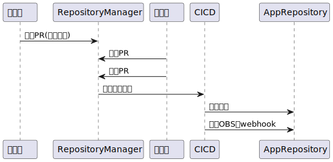

# linglongdev 仓库管理

## 申请应用仓库

开发者向 github 中 linglongdev 组织下的 Repository-Manager 项目提交 PR，修改 repos.yaml 文件，申请创建应用仓库。

创建新应用仓库需要填写以下字段

```yaml
- repo: 仓库名
  info: 简介
  developer: 开发者github用户名
```

创建应用仓库的 PR 合并后，将会自动在 linglongdev 组织下创建该项目

<!--
@startuml
开发者 -> RepositoryManager: 提交PR(创建仓库)
管理员 -> RepositoryManager: 审查PR
管理员 -> RepositoryManager: 合并PR
RepositoryManager -> CICD: 触发仓库创建
CICD -> AppRepository: 创建仓库
@enduml
 -->



## 应用仓库管理

1. 开发者向应用仓库以 PR 方式修改 linglong.yaml 文件
2. PR 会触发自动化构建，在 PR 下面会贴出 layer 文件的下载地址，等待构建完成后可下载对应的 layer 文件
3. 如果 PR 更改了 linglong.yaml 里面的版本号，在 PR 合并后会自动创建 tag
4. 创建 tag 会触发自动化构建，构建完成后会推送应用到外网玲珑仓库


<!--
```plantuml
@startuml
actor 开发者
开发者 -> AppRepository: 提交PR
AppRepository -> CICD: 触发测试构建
actor 管理员
管理员 -> AppRepository: 审查PR
管理员 -> CICD: 下载构建结果进行测试
管理员 -> AppRepository: 合并PR

alt 如果修改了linglong.yaml的version
CICD -> AppRepository: 创建tag
AppRepository -> CICD: 触发tag构建
CICD -> Stable仓库: 推送应用
end
@enduml
``` -->
